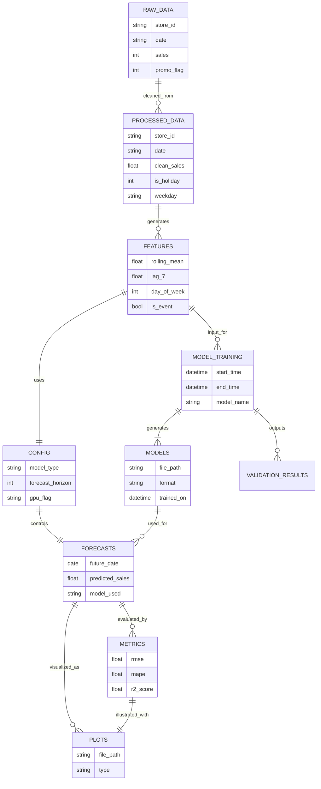

# SaleFore AI 📈 – Ultra-Accurate, GPU-Optimized Sales Forecasting Suite

> _"Turning raw retail data into crystal-clear sales foresight."_  
> 🎯 Powered by: **XGBoost**, **LightGBM**, **CatBoost**, **Prophet**, **Optuna**, and **CUDA**  
> 💼 Engineered by: **Vishnupriyan P R**


---

## 🚀 Overview

**SaleFore AI** is a modular, production-ready, GPU-accelerated machine learning system that delivers highly accurate sales forecasting for retail and e-commerce businesses. With automated preprocessing, feature engineering, model training, and Power BI-ready outputs — this suite was built to **replace traditional forecasting pipelines with intelligent automation and accuracy**.

---

## 🧠 Key Features

- 🔁 **Automated Feature Engineering** – Temporal, cyclical, rolling, lag, and store-level features
- 🧠 **Ensemble Models** – Uses XGBoost, CatBoost, LGBM, RF, ElasticNet, Prophet
- ⚙️ **Hyperparameter Tuning** – Smart optimization using Optuna
- ⚡ **GPU Support** – Full GPU-acceleration (RTX tested)
- 🧪 **Time Series Validation** – Non-leaky splits using TimeSeriesSplit
- 📦 **Modular Pipeline** – Train once, reuse with ease; full model persistence
- 📊 **Power BI Compatible Output** – Exported forecasts ready to be visualized
- 🔒 **Failsafe CPU fallback** – No GPU? No problem.

---

## 📁 Project Structure

```
SaleFore-AI/
├── data/
│   ├── raw/               # Unprocessed datasets
│   ├── processed/         # Cleaned and feature-rich data
│   └── forecasts/         # Final forecast results
├── models/                # Trained models and artifacts
├── outputs/               # Metrics, logs, plots, evals
├── src/
│   ├── config.py          # Constants, file paths, parameters
│   ├── preprocess.py      # All cleaning + feature engineering logic
│   ├── train_model.py     # Model training and tuning
│   ├── forecast.py        # Inference pipeline for future dates
│   └── utils.py           # Common utilities
└── requirements.txt       # Dependencies list
```

---

## 🛠️ Installation

```bash
git clone https://github.com/vishnupriyanpr183207/SaleFore-AI
cd SaleFore-AI
pip install -r requirements.txt
```

---

## 🔧 Configuration (in `config.py`)

Set paths for:
- `RAW_DATA_PATH`, `PROCESSED_DATA_PATH`
- `FORECAST_OUTPUT_PATH`
- `MODEL_SAVE_DIR`, etc.

Also configure:
- GPU flags
- Forecasting horizon
- Train/val/test split logic
- Feature flags (e.g., enable/disable Prophet)

---

## 🔄 ML Pipeline

### 1. Data Preprocessing (`preprocess.py`)
- Handles missing data, removes outliers
- Generates rolling mean, lag, day-of-week, month, holiday, promo, event, etc.

### 2. Model Training (`train_model.py`)
- Trains multiple models in parallel (LightGBM, CatBoost, Prophet, XGBoost, ElasticNet, RF)
- Optimizes using Optuna with early stopping
- Exports: `model.pkl`, `metrics.json`, `importance.png`

### 3. Forecasting (`forecast.py`)
- Loads trained models
- Predicts N future time steps
- Saves output in Power BI-compatible CSV

---

## 📈 Output

```text
outputs/
├── forecast_results.csv         # Final predictions
├── model_metrics.json           # Accuracy, RMSE, MAPE, etc.
├── plots/
│   ├── feature_importance.png
│   └── prediction_vs_actual.png
```

---

## 📊 Dashboard Integration

1. Import `forecast_results.csv` in Power BI or Tableau
2. Connect model metrics
3. Build dynamic trend visualizations & what-if simulators

---

## 🗂️ Project ER Diagram




---

## 🧪 Requirements

```txt
pandas
numpy
scikit-learn
xgboost
lightgbm
catboost
prophet
optuna
matplotlib
seaborn
joblib
tqdm
```

---

**Made with 💓 Vishnupriyan P R**  
📧 `priyanv783@gmail.com`  
🔗 GitHub: [vishnupriyanpr](https://github.com/vishnupriyanpr)


## 📜 License

MIT License – use, share, and scale freely.
